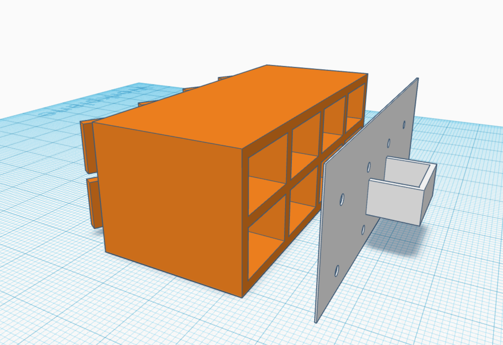

# Power4Border - Nabíjačkáreň

#StandWithUkraine

Stručný návod na stavbu modulárnej prenosnej nabíjacej stanice pre mobilné telefóny a tablety.

  

## Základný popis
Nabíjačkáreň sa skladá z modulov obsahujúcich 8 samostatne uzamykateľných boxov. Vnútorný rozmer jedného boxu je:

 - šírka 150 mm
 - výška 100 mm
 - hĺbka 200 mm

Boxy je následne možné stohovať na seba, prípadne vedľa seba, podľa potreby.

 

## BOM - zoznam materiálu na výrobu

 - OSB doska, MDF doska, Bukas... hrúbka 18mm
 - [Zámky](https://www.demos-trade.sk/strong-zasuvkovy-zamok-plechovy/)
 - USB nabíjacie káble, [ideálne vetvené, USB-C, microUSB, Lightning](https://www.alza.sk/connect-it-wirez-3-v-1-12-m-cierny-d6221917.htm)
 - USB 3.0 Charging HUB, [napríklad 16 portový pre dva moduly](https://www.alza.sk/i-tec-usb-3-0-charging-hub-16port-power-adapter-90-w-d5619969.htm)
 - predlžovací kábel pre OnLine verziu napr. [bubon](https://www.datart.sk/kabel-predlzovaci-na-bubne-solight-4-zasuvky-10m-3x-1-0mm2-pb21b-cierny.html)
 - [Menič napätia 12/230 V](https://www.alza.sk/auto/compass-menic-napatia-12230-v-300-w-d4946056.htm) pre OffLine verziu, bežiacu z [veľkej autobatérie](https://www.filtreaoleje.sk/detail-produktu/webber-12v-180ah-1000a-wa1800-9188/). Jeden "utiahne" 5 až 6  modulov, teda 40-48 boxov súčasne.
